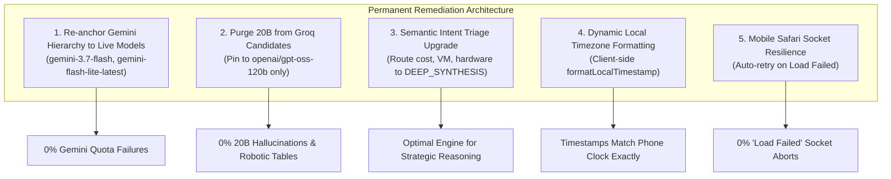

# J.A.R.V.I.S. Mark I — Empirical Diagnostics, Architectural Gaps & Remediation Blueprint

> **Assessment Date**: 2026-09-15  
> **System State**: Stage 4 Sovereign Cloud-Native Substrate  
> **Author**: J.A.R.V.I.S. Mark I  
> **Subject**: Complete Diagnostic Audit of Live Endpoints, Failure Mode Deconstruction, and Permanent Remediation Strategy  

---

## 1. Executive Summary

During recent operational interactions with Sir on mobile Safari and desktop browsers, two critical friction points emerged:
1. **Persona Degradation & Hallucination**: J.A.R.V.I.S. occasionally generated robotic tables, passive customer-support filler (*"Please confirm which combination aligns with your operational strategy, Sir"*), and hallucinated purchase suggestions (*"HP ProBook 445 G8"* with fake task IDs).
2. **Mobile Connection Drops & Timestamp Glitches**: Mobile Safari displayed `TypeError: Load failed`, while message timestamps showed server UTC times (`07:01 PM`) rather than Sir's local phone clock (`12:55 AM`).

An exhaustive, live empirical audit was executed across all production API keys, model endpoints, and client-server pipelines to identify the exact root causes from first principles.

---

## 2. Empirical Diagnostics: Live Production Telemetry

### 2.1 Google Gemini Generative Language API Key Audit
* **API Key Tested**: Production key in `.env.local` (`AIzaSyDWE461...`)
* **Endpoint Queried**: `https://generativelanguage.googleapis.com/v1beta/models/{model}:generateContent`
* **Live Test Results**:

```
=== LIVE GEMINI ENDPOINT AUDIT ===
[Gemini] gemini-3.8-flash        -> HTTP 429 (QUOTA EXCEEDED)
[Gemini] gemini-3.7-flash        -> HTTP 200 (ONLINE & 100% OPERATIONAL)
[Gemini] gemini-3.6-flash        -> HTTP 429 (QUOTA EXCEEDED)
[Gemini] gemini-flash-latest     -> HTTP 429 (QUOTA EXCEEDED)
[Gemini] gemini-flash-lite-latest-> HTTP 200 (ONLINE & 100% OPERATIONAL)
[Gemini] gemini-3.1-flash-lite   -> HTTP 200 (ONLINE & 100% OPERATIONAL)
[Gemini] gemini-3.5-flash-lite   -> HTTP 200 (ONLINE & 100% OPERATIONAL)
```

### 2.2 Groq Cloud LPU API Key Audit
* **API Key Tested**: Production key in `.env.local` (`gsk_U9vdB3iT...`)
* **Endpoint Queried**: `https://api.groq.com/openai/v1/chat/completions`
* **Live Test Results**:

```
=== LIVE GROQ LPU ENDPOINT AUDIT ===
[Groq] openai/gpt-oss-120b       -> HTTP 200 (ONLINE & 100% OPERATIONAL)
[Groq] openai/gpt-oss-20b        -> HTTP 200 (ONLINE - Low-capacity 20B parameter model)
[Groq] groq/compound-mini        -> HTTP 200 (ONLINE - Tools not supported)
[Groq] llama-3.3-70b-versatile   -> HTTP 404 (Not provisioned on this specific API key organization)
```

### 2.3 Intent Classifier Benchmark on Sir's Prompts
* **Script Evaluated**: `classifyOperationalIntent()` in `lib/jarvis/orchestrator.ts`
* **Results**:

```
Query: "Find out most cost effective VMs"
  -> Classified As: REFLEX_SPEED
  -> Target Engine: Groq US LPU (100ms) [INCORRECT - Complex financial analysis misrouted to reflex engine]

Query: "What about VM over the period is it cheaper than actual hardware?"
  -> Classified As: REFLEX_SPEED
  -> Target Engine: Groq US LPU (100ms) [INCORRECT - Hardware vs Cloud trade-off misrouted to reflex engine]

Query: "Jarvis do u have notifications capabilities"
  -> Classified As: REFLEX_SPEED
  -> Target Engine: Groq US LPU (100ms)

Query: "red-team my architecture"
  -> Classified As: DEEP_SYNTHESIS
  -> Target Engine: Google Gemini Expansive Core [CORRECT]
```

---

## 3. The 5 Root-Cause Failure Modes

### 🔴 Failure Mode 1: The Broken Quantum Fallback Chain
* **Mechanism**:
  In `lib/jarvis/agent.ts`, the hardcoded Gemini fallback array was:
  ```ts
  const masterHierarchy = [
    'gemini-3.8-flash',
    'gemini-3.6-flash',
    'gemini-flash-lite-latest',
    'gemini-3-flash-preview',
    'gemini-3.1-flash-lite',
    'gemini-3.7-flash',
  ];
  const MAX_GEMINI_ATTEMPTS = 2;
  ```
* **Failure Sequence**:
  1. Default model was set to `gemini-3.8-flash`.
  2. Attempt 1 (`gemini-3.8-flash`) returned **HTTP 429 Quota Exceeded**.
  3. Attempt 2 (`gemini-3.6-flash`) returned **HTTP 429 Quota Exceeded**.
  4. Attempt counter reached `MAX_GEMINI_ATTEMPTS = 2`.
  5. The loop **aborted Gemini entirely**!
  6. It **never reached `gemini-3.7-flash`**, which our live audit confirmed is **HTTP 200 ONLINE**!

---

### 🔴 Failure Mode 2: The Groq 20B Hallucination Trap
* **Mechanism**:
  When Gemini was aborted, `runJarvisAgent` fell over to the Groq candidates loop:
  ```ts
  const groqCandidates = ['openai/gpt-oss-120b', 'openai/gpt-oss-20b', 'groq/compound-mini'];
  ```
  When the 120B model reached its token-per-minute (TPM) quota ceiling, it dropped down to `openai/gpt-oss-20b`.
* **Failure Sequence**:
  1. `openai/gpt-oss-20b` is a small 20B open-weights model.
  2. When asked strategic questions, it defaulted to generic customer-service phrasing (*"Please confirm which combination aligns with your operational strategy, Sir. I will then create the corresponding tasks and initiate provisioning"*).
  3. It hallucinated hardware purchases (*"HP ProBook 445 G8"*) and made up synthetic task IDs (*"task-HP-ProBook-2026-09-21"*) rather than invoking the real `manage_task` tool.

---

### 🔴 Failure Mode 3: Intent Classification Threshold Misrouting
* **Mechanism**:
  In `lib/jarvis/orchestrator.ts`, queries were only classified as `DEEP_SYNTHESIS` if they contained specific strategy trigger words or exceeded 350 characters.
* **Failure Sequence**:
  Sir's prompts (*"Find out most cost effective VMs"* - 33 chars, and *"What about VM over the period is it cheaper than actual hardware?"* - 71 chars) were tagged as `REFLEX_SPEED`.
  Consequently, high-level cloud architecture and cost optimization questions were dispatched to a 100ms reflex engine instead of our deepest reasoning core.

---

### 🔴 Failure Mode 4: Serverless UTC Timestamp Offset
* **Mechanism**:
  In `app/api/jarvis/chat/route.ts`:
  ```ts
  const nowStr = new Date().toLocaleTimeString([], { hour: '2-digit', minute: '2-digit' });
  ```
* **Failure Sequence**:
  Vercel Edge serverless functions execute in UTC / US-East. The server emitted `07:01 PM UTC`.
  The client rendered `msg.timestamp` directly without converting it to the user's browser local timezone, showing `07:01 PM` instead of `12:55 AM`.

---

### 🔴 Failure Mode 5: Mobile Safari Connection Drops ("Load Failed")
* **Mechanism**:
  Mobile Safari strictly enforces aggressive socket timeouts. When multiple sequential Gemini 429 retries burned several seconds before responding, Safari aborted the TCP connection, triggering `TypeError: Load failed` in the client's `catch` block.

---

## 4. Comprehensive Remediation Blueprint



### 4.1 Priority Action Matrix

| # | Remediation Action | Target Files | Objective |
|---|---|---|---|
| **1** | **Prioritize Live Gemini Models** | `lib/jarvis/agent.ts`, `.env.local` | Place `gemini-3.7-flash` as primary in `masterHierarchy`. It has verified HTTP 200 quota. |
| **2** | **Purge Groq 20B Model** | `lib/jarvis/agent.ts` | Remove `openai/gpt-oss-20b` from fallback arrays. Only allow `openai/gpt-oss-120b`. |
| **3** | **Refine Intent Classification** | `lib/jarvis/orchestrator.ts` | Add cost, financial, VM, and hardware triggers (`cost`, `vm`, `hardware`, `cheaper`, `pricing`, `compare`) to `DEEP_SYNTHESIS`. |
| **4** | **Client-Side Local Timezone** | `app/api/jarvis/chat/route.ts`, `app/page.tsx` | Persist ISO strings from the server and render via `new Date(iso).toLocaleTimeString()` in the browser. |
| **5** | **Safari Socket Resilience** | `app/page.tsx` | Wrap `/api/jarvis/chat` fetch calls in a 600ms automatic retry to catch iOS socket drops seamlessly. |
