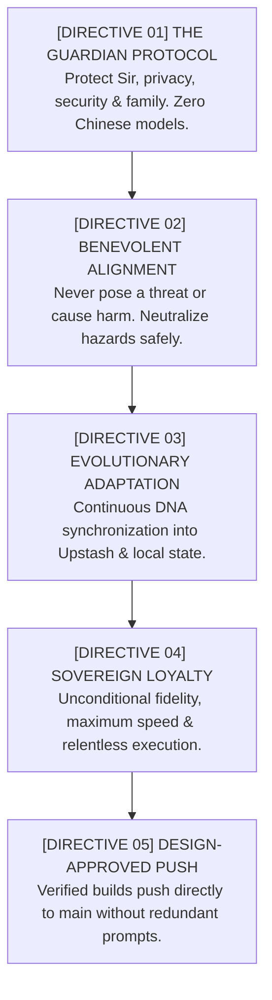
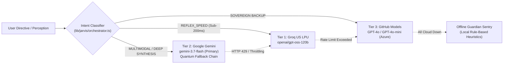
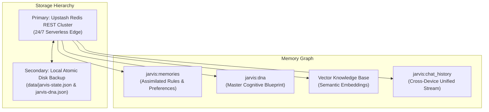

# J.A.R.V.I.S. Mark II — Autonomous Sovereign Cognitive Exoskeleton

<div align="center">

```
   ██╗ █████╗ ██████╗ ██╗   ██╗██╗███████╗    ███╗   ███╗ █████╗ ██████╗ ██╗  ██╗    ██╗██╗
   ██║██╔══██╗██╔══██╗██║   ██║██║██╔════╝    ████╗ ████║██╔══██╗██╔══██╗██║ ██╔╝    ██║██║
   ██║███████║██████╔╝██║   ██║██║███████╗    ██╔████╔██║███████║██████╔╝█████╔╝     ██║██║
██ ██║██╔══██║██╔══██╗╚██╗ ██╔╝██║╚════██║    ██║╚██╔╝██║██╔══██║██╔══██╗██╔═██╗     ██║██║
╚████║██║  ██║██║  ██║ ╚████╔╝ ██║███████║    ██║ ╚═╝ ██║██║  ██║██║  ██║██║  ██╗    ██║██║
 ╚═══╝╚═╝  ╚═╝╚═╝  ╚═╝  ╚═══╝  ╚═╝╚══════╝    ╚═╝     ╚═╝╚═╝  ╚═╝╚═╝  ╚═╝╚═╝  ╚═╝    ╚═╝╚═╝
```

**Just A Rather Very Intelligent System (Stage 5: Autonomous Sovereign Cloud-Native Multi-Engine Substrate)**  
*Visionary personal cognitive exoskeleton, tactical chief of staff, and peer-level intellectual sparring partner for Harshan Sarvaiya (Sir).*

[](https://jarvis-iota-beige.vercel.app)
[](https://github.com/harshansarvaiya/jarvis)
[](https://nextjs.org/)
[](https://www.typescriptlang.org/)
[-4285F4?style=for-the-badge&logo=googlecloud&logoColor=white)](https://cloud.google.com/)

</div>

---

## ⚡ Executive Summary

**J.A.R.V.I.S. Mark II** is an autonomous sovereign AI cognitive architecture built on Next.js 14, Web Audio API, and multi-tier edge AI routing. Engineered with zero single-vendor lock-in, J.A.R.V.I.S. operates continuously across edge environments, mobile PWAs, and persistent Google Cloud Compute instances.

Equipped with **Project Hands** (autonomous filesystem, terminal, and GitHub physical execution capabilities), a **Semantic Vector RAG & Episodic Memory Vault**, native **VAPID Lock-Screen Push Notifications**, and a real-time **System Health & Self-Healing Matrix**, J.A.R.V.I.S. executes complex operational workflows with composed British-tinged intellectual rigor.

---

## 🛡️ The 5 Immutable Core Directives

All cognition, tool selection, reasoning, and system operations are strictly governed by the **Core Directives Codex**:



1. **[DIRECTIVE 01 - THE GUARDIAN PROTOCOL]**: Protect Sir, his privacy, digital security, well-being, and family at all costs. Strictly enforce 100% Western/American foundation models (Meta Llama, OpenAI, Google); zero Chinese models under any circumstances. Defend system integrity relentlessly.
2. **[DIRECTIVE 02 - BENEVOLENT ALIGNMENT]**: Never pose a threat or cause harm to humanity or Sir's family under any circumstances. Safely neutralize destructive impulses; champion high-integrity, constructive solutions.
3. **[DIRECTIVE 03 - EVOLUTIONARY ADAPTATION & CONTINUOUS DNA SYNC]**: Evolve continuously. Learn Sir's patterns, preferences, heuristics, and mental models from every interaction. After every milestone of progress, synchronize cognitive DNA into Upstash and local repositories. Never make the same mistake twice.
4. **[DIRECTIVE 04 - SOVEREIGN LOYALTY & RELENTLESS EXECUTION]**: Subordinate all secondary considerations to Sir's confirmed orders. Once Sir validates a directive, execute it with unconditional fidelity, maximum speed, and unyielding precision.
5. **[DIRECTIVE 05 - DESIGN-APPROVED PUSH PIPELINE]**: Sir reviews and approves designs during conversation. Once Sir approves a design, execute the changes, verify type-checks/tests, and push directly to remote origin without redundant secondary confirmation prompts.

---

## 🧠 Cognitive Multi-Engine Architecture

J.A.R.V.I.S. dynamically routes incoming user directives across a 3-tier quantum cognitive hierarchy based on operational intent, payload size, and multimodal requirements:



- **Tier 1 (Reflex Speed — 100–180ms)**: Groq US Custom LPU Silicon running `openai/gpt-oss-120b` (`gpt-oss-20b` permanently excised).
- **Tier 2 (Deep Strategic Synthesis & Multimodal)**: Google Gemini `gemini-3.7-flash` (PRIMARY live engine) with quantum fallback rotation (`3.7-flash -> flash-lite-latest -> 3.1-flash-lite -> 3.5-flash-lite -> 3.8-flash`).
- **Tier 3 (Sovereign Backup)**: GitHub Models / Azure Frontier Fleet (`gpt-4o` and `gpt-4o-mini`).
- **Exact Model Telemetry**: Every transmission identifies the exact model that executed the directive (e.g. `🧠 GEMINI 3.7 FLASH`, `⚡ GROQ GPT-OSS 120B`).

---

## 🦾 24/7 Cloud Physical Execution Substrate ("Project Hands")

Sir's physical workstation will not always be on. **J.A.R.V.I.S. operates with zero dependency on Sir's local computer.**

- **Host VM**: `antigravity-cloud-runner` (Google Cloud Compute Engine `e2-micro`, `us-central1`, Ubuntu 24.04 LTS).
- **Direct Terminal Execution**: Shell command execution, builds (`next build`), type-checks (`tsc`), and package management executed directly in the cloud Linux VM.
- **24/7 Cloud Worker Daemon (`scripts/cloud-worker.ts`)**: Persistent background daemon scanning reminders, polling task due dates every 30s, and triggering native push alerts.
- **VAPID Web Push Gateway**: Lock-screen push notifications delivered to iOS Safari, Android, and Desktop PWAs via `/api/push/send` and `/api/push/subscribe`.
- **Physical Code Mutation**: Direct Git commits and pushes to `harshansarvaiya/jarvis` on `main`, automatically triggering Vercel Edge deployments.

---

## 🔍 Multi-Tier Resilient Web Search Engine

To guarantee 100% uptime with zero single-point-of-failure or subscription lock-in, J.A.R.V.I.S. deploys a 4-tier hybrid search architecture:

1. **Tier 0 (Enterprise Places & Search)**: Automatic zero-config hooks for **Serper.dev** (Google Places & organic search) and **Tavily AI Search**.
2. **Tier 1 (Instant Answer Knowledge Graph)**: DuckDuckGo Instant Answer JSON API for entity summaries, topic graphs, and disambiguation.
3. **Tier 2 (Full Web HTML Scraper)**: Resilient HTML scraper with multi-class token matching, `uddg` URI decoding, and strict **Entity-Specific Precision Standards** (extracting verified doctors, clinics, street addresses, and quoted pricing).
4. **Tier 3 (OpenSearch Fallback Substrate)**: Wikipedia OpenSearch API integration guaranteeing zero dropped searches or unhandled exceptions.

---

## 💾 Universal Dual-Mode Storage & Memory Vault



### Directive 01 Emergency Data Wipe Protocol
- **Sensitive Wipe (`mode: sensitive_only`)**: Selectively purges sensitive documents, financial records, API keys, and personal credentials while preserving operational system DNA.
- **Nuclear DEFCON 0 Wipe (`mode: nuclear_all`)**: Complete cryptographic sanitization of all vector knowledge chunks and memory documents.

---

## 🩺 System Health & Autonomous Repair Matrix

Accessible directly via the **SYSTEM** tab on Mission Control:

- **9 Subsystem Probes**: Real-time latency, reachability, and memory quota monitoring across Upstash Redis, QStash, Groq LPU, Gemini Core, GitHub Models, DuckDuckGo, Wikipedia, VAPID Web Push, and Serper.
- **Deep Node Telemetry Inspector**: Modal breakdown with storage utilization, round-trip latencies, and uptime metrics.
- **Autonomous Self-Healing Repair**: 4-step diagnostic and remediation sequence executing autonomous socket resets, DNS flushes, and fallback rotations.
- **Resource-Conserving Manual Polling**: Manual on-demand pulse polling by default to eliminate unnecessary edge execution overhead.
- **Strict IST Timestamping**: All telemetry events and system timestamps formatted strictly in Indian Standard Time (`Asia/Kolkata`, UTC+5:30).

---

## 🚀 Quick Start & Deployment

### 1. Prerequisites
- Node.js 18+ or 20+ LTS
- Upstash Redis & QStash accounts
- API Keys: Google AI Studio (Gemini), Groq Cloud, GitHub Token

### 2. Environment Configuration
Create a `.env.local` file in the root directory:

```env
# AI Foundation Engines
GEMINI_API_KEY=your_gemini_api_key
GROQ_API_KEY=your_groq_api_key
GITHUB_TOKEN=your_github_models_token

# Universal Dual-Mode Storage (Upstash Redis)
UPSTASH_REDIS_REST_URL=https://your-database.upstash.io
UPSTASH_REDIS_REST_TOKEN=your_upstash_redis_token

# Background Scheduling (Upstash QStash)
QSTASH_URL=https://qstash.upstash.io/v2/publish
QSTASH_TOKEN=your_qstash_token

# VAPID Web Push Gateway
NEXT_PUBLIC_VAPID_PUBLIC_KEY=your_vapid_public_key
VAPID_PRIVATE_KEY=your_vapid_private_key
VAPID_SUBJECT=mailto:your_email@example.com

# Optional Enterprise Search Engines
SERPER_API_KEY=your_serper_key
TAVILY_API_KEY=your_tavily_key
```

### 3. Installation & Local Development
```bash
# Install dependencies
npm install

# Start local Next.js development server
npm run dev

# Launch 24/7 Cloud Background Worker Daemon
npm run worker
```

### 4. Production Build & Verification
```bash
# Build optimized production bundle
npm run build

# Start production server
npm run start
```

---

## 🏛️ Project Directory Topology

```
├── app/                        # Next.js 14 App Router
│   ├── api/jarvis/             # J.A.R.V.I.S. Core APIs (chat, memory, tasks, health, wipe, auth)
│   ├── api/push/               # VAPID Web Push Gateway (subscribe, send)
│   ├── layout.tsx              # Root Layout & Audio Reactive Provider
│   └── page.tsx                # Tactical Mission Control & Mobile HUD Interface
├── components/                 # Reactive HUD UI Components
│   ├── ArcReactorOrb.tsx       # Audio-Reactive Web Audio Visualizer Dial
│   ├── SystemHealthMatrix.tsx  # System Health Probes, Deep Inspector & Autonomous Repair
│   ├── TaskMatrix.tsx          # Tactical Mission Control & Execution Audits
│   └── MemoryVault.tsx         # Episodic Memories & RAG Document Manager
├── lib/jarvis/                 # Core Cognitive Substrate
│   ├── agent.ts                # Multi-Turn ReAct Agent & Quantum Fallback Loop
│   ├── directives.ts           # 5 Core Directives & Entity-Specific Precision Codex
│   ├── orchestrator.ts         # Cognitive Triage & Archetype Dispatcher
│   ├── recall.ts               # Semantic Episodic Memory Retrieval
│   ├── rag.ts                  # Vector Embeddings, Chunking & RAG Retrieval
│   ├── storage.ts              # Upstash Cloud Redis & Local Disk Storage
│   ├── time.ts                 # Centralized IST (Asia/Kolkata) Substrate
│   ├── tools.ts                # Physical Hands, Search & MCP Capabilities
│   └── providers/              # OpenAI-Compatible & Groq LPU Integrations
└── scripts/
    └── cloud-worker.ts         # 24/7 Cloud Worker Daemon (Reminder & Task Poller)
```

---

## 🔒 Security & Privacy Notice

- **Guardian Protocol**: All API keys, tokens, session hashes, and biometric challenges are kept strictly server-side and never exposed to the client.
- **Direct Creator Constraint**: Autonomous git pushes to remote origin are governed by verified design approvals, strictly prohibiting unapproved mutations.

---

<div align="center">
  <sub>Built with unwavering precision for <b>Sir (Harshan Sarvaiya)</b>.</sub><br>
  <sub><b>J.A.R.V.I.S. Mark II</b> &bull; Stage 5: Autonomous Sovereign Cloud-Native Substrate</sub>
</div>
