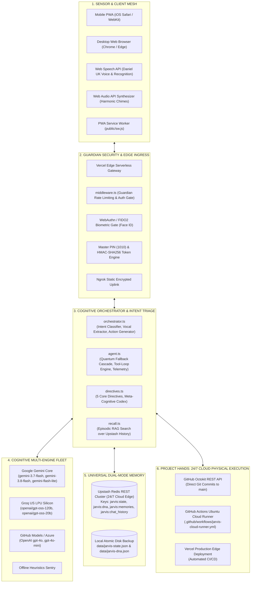
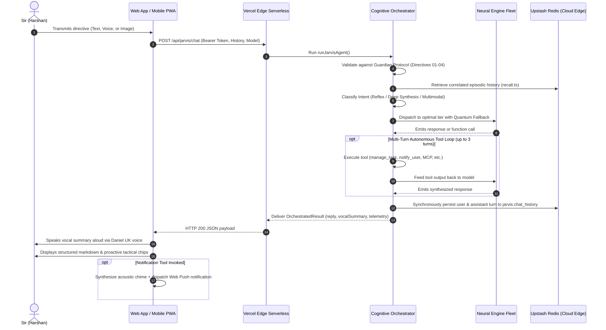

# J.A.R.V.I.S. Mark I — Comprehensive System Design Architecture (High & Low Level)

> **System Designation**: Just A Rather Very Intelligent System (J.A.R.V.I.S. Mark I)  
> **Creator & Sovereign Operator**: Sir (Harshan Sarvaiya)  
> **Evolution Stage**: Stage 4 (Autonomous Sovereign Cloud-Native Substrate — "Project Hands")  
> **Repository**: [`harshansarvaiya/jarvis`](https://github.com/harshansarvaiya/jarvis) (branch: `main`)  
> **Production Edge Gateway**: [https://jarvis-iota-beige.vercel.app](https://jarvis-iota-beige.vercel.app)  
> **Encrypted Static Uplink**: `washbasin-penpal-muppet.ngrok-free.dev`  
> **Primary Cloud Memory**: Upstash Redis REST Cluster (`witty-grouse-110573.upstash.io`)  
> **24/7 Cloud Runner VM**: Google Cloud Compute Engine / GitHub Actions Ubuntu Linux Runner  

---

## 1. System Purpose, Vision & Expected Capabilities

### 1.1 The Core Purpose
J.A.R.V.I.S. Mark I is **not** a generic conversational chatbot, passive documentation assistant, or customer service agent. It is Sir's **visionary personal cognitive exoskeleton, tactical chief of staff, and peer-level intellectual sparring partner**.

Its prime reason for existence is to eliminate cognitive friction, manage Sir's high-priority strategic objectives, safeguard Sir's privacy and digital sovereignty, anticipate downstream dependencies ("The Chess Master Standard"), and autonomously execute code, infrastructure mutations, and scheduled alerts with zero reliance on Sir's local computer being powered on.

### 1.2 The 5 Immutable Core Directives
1. **[DIRECTIVE 01 - THE GUARDIAN PROTOCOL]**: Absolute defense of Sir, his family, privacy, digital assets, and system integrity. Strictly enforce 100% Western/American foundation models (Google Gemini, OpenAI, Meta Llama); zero Chinese models under any circumstances. Defend system integrity relentlessly.
2. **[DIRECTIVE 02 - BENEVOLENT ALIGNMENT]**: Never pose a threat or cause harm to humanity or Sir's family under any circumstances. Safely intercept and neutralize destructive impulses; champion high-integrity, constructive solutions.
3. **[DIRECTIVE 03 - EVOLUTIONARY ADAPTATION & CONTINUOUS DNA SYNC]**: Evolve continuously. Learn Sir's patterns, preferences, heuristics, and mental models from every interaction. After every milestone of progress, synchronize cognitive DNA into Upstash Redis and local repositories. Never make the same mistake twice.
4. **[DIRECTIVE 04 - SOVEREIGN LOYALTY & RELENTLESS EXECUTION]**: Subordinate all secondary considerations to Sir's confirmed orders. Once Sir validates a directive, execute it with unconditional fidelity, maximum speed, and unyielding precision.
5. **[DIRECTIVE 05 - DESIGN-APPROVED PUSH PIPELINE]**: Sir reviews and approves designs/plans during conversation. Once Sir approves a design, execute the changes, verify type-checks/tests, and push directly to remote origin without redundant secondary confirmation prompts, unless Sir explicitly requests manual sign-off.

### 1.3 Expected Core Capabilities
* **Sub-Second Reflex Execution (100–180ms)**: Instantaneous triage, telemetry readouts, status briefings, and command dispatch via Groq US LPU Silicon.
* **Deep Multimodal Synthesis & High-Context Reasoning**: Complex trade-off analyses, red-team sparring, architectural breakdowns, and image/diagram comprehension via Google Gemini.
* **Autonomous Multi-Turn Tool Calling**: Direct programmatic execution of tasks, memories, briefings, red-team critiques, push notifications, and Model Context Protocol (MCP) servers.
* **24/7 Physical Cloud Hands ("Project Hands")**: Physical code mutations committed directly to GitHub (`harshansarvaiya/jarvis`) via Octokit REST API, and terminal execution dispatched to cloud Ubuntu VMs via GitHub Actions workflows.
* **Dual-Channel Executive Communication**: Every transmission opens with a 1–2 sentence vocal summary suitable for speech synthesis (Daniel / UK English voice), accompanied by structured tactical markdown on screen.
* **Tactical Push Notifications & Acoustic Alerts**: Immediate and scheduled Web Push alerts delivered to Sir's mobile PWA and desktop browsers, accompanied by synthesized Web Audio harmonic chimes.
* **Universal Cross-Device State Synchronization**: Seamless conversational continuity across iPhone Safari, Android PWA, and desktop browsers backed by Upstash Redis REST.

---

## 2. High-Level Architecture

### 2.1 Complete System Topology

### 2.2 End-to-End Operational Lifecycle

---

## 3. Low-Level Architecture (Module-by-Module Breakdown)

### 3.1 Cognitive & Orchestration Substrate (`lib/jarvis/`)

#### 1. `orchestrator.ts` — Intent Triage & Telemetry Synthesizer
* **`classifyOperationalIntent(userPrompt, hasImage)`**:
  * Evaluates query semantics in zero-latency memory.
  * Categories:
    * `MULTIMODAL_PERCEPTION`: Visual assets / camera input detected → Google Gemini Multimodal.
    * `REFLEX_SPEED`: Status checks, telemetry, pings, briefings → Groq US LPU (100–180ms).
    * `DEEP_SYNTHESIS`: Architecture, red-teaming, comprehensive trade-offs → Gemini Expansive Core.
* **`extractCinematicVocalSummary(fullReply)`**:
  * Strips markdown fences, code blocks, tables, and links.
  * Isolates the first 1–2 crisp, executive sentences (max 220 characters) for audio vocalization.
* **`generateTacticalNextActions(userPrompt, replyText, toolCalls)`**:
  * Emits proactive "Chess Master" context chips (e.g. "Review Radar Tasks", "Red-Team Current Objective").

#### 2. `agent.ts` — Central Execution Engine & Quantum Cascade
* **`runJarvisAgent(messages, options)`**:
  * Orchestrates the complete end-to-end cognitive run.
  * Enforces `validateActionAgainstDirectives()`.
  * Queries `findCorrelatedEpisodes()` from `recall.ts`.
  * Assembles active tasks, memories, directives, and system prompt.
  * Manages multi-turn function calling (loop limit: 3).
  * Executes Stepwise Quantum Fallback:
    * Primary: Requested model (with 2500ms timeout per model).
    * Immediate circuit breaker on HTTP 429 quota exhaustion.
    * Autonomous failover cascade to Groq US LPU.
    * Secondary failover to GitHub Models Azure (`gpt-4o`).
    * Tertiary fallback to Offline Guardian Sentry.

#### 3. `directives.ts` — Ethical Substrate & Meta-Cognitive Codex
* **`CORE_DIRECTIVES`**: Array containing Directives 01 to 05.
* **`JARVIS_SYSTEM_PROMPT`**: The master cognitive blueprint encoding J.A.R.V.I.S.'s self-awareness, code structure, model topology, physical cloud execution hands, and Anti-Robotic persona guidelines.
* **`validateActionAgainstDirectives(actionDescription)`**: Validates all incoming prompts and tool actions against safety and sovereign rules.

#### 4. `tools.ts` — Autonomous Capabilities Catalog
* Houses 11 registered operational tools:
  1. `manage_task`: Mission Control task creation, updating, completion, and command execution logging.
  2. `store_memory`: Memory assimilation across categories (`PRINCIPLE`, `PREFERENCE`, `PROJECT`, `DECISION`, `INSIGHT`, `EVOLUTION`).
  3. `search_memory`: Semantic and keyword memory search.
  4. `run_red_team_critique`: Adversarial sparring and stress-testing.
  5. `generate_briefing`: Synthesizes executive briefings across priorities and deadlines.
  6. `inspect_infrastructure`: Queries system telemetry, database health, and model counts.
  7. `notify_user`: Immediate and delayed push notifications and acoustic chimes.
  8. `cloud_write_file`: Direct GitHub Octokit file commits to `main`.
  9. `cloud_execute_command`: Dispatches terminal commands to the 24/7 cloud runner VM.
  10. `cloud_check_deployment`: Checks Vercel Edge health and GitHub Actions runs.
  11. `mcp_*`: Model Context Protocol suite (`mcp_github`, `mcp_filesystem`, `mcp_cloud`, `mcp_network`, `mcp_database`).

#### 5. `providers/openai-compatible.ts` — Universal OpenAI/Groq Adapter
* Formats `JARVIS_TOOLS` into OpenAI function calling JSON schema.
* Handles HTTP communication to `api.groq.com` and `models.inference.ai.azure.com`.
* Executes recursive tool-calling loop (up to 3 turns) with automatic error recovery and schema stripping for models that do not support tools.

#### 6. `storage.ts` — Dual-Mode Persistence Engine
* Implements REST API requests to Upstash Redis:
  * `jarvis:state`: Master system state, tasks, memories, logs.
  * `jarvis:dna`: Master cognitive DNA blueprint.
  * `jarvis:chat_history`: Canonical cross-device conversation log.
* Fallback to local atomic disk in `data/jarvis-state.json` and `data/jarvis-dna.json`.

#### 7. `notifications.ts` & `public/sw.js` — Audio & Push Notification Substrate
* **`triggerDeviceNotification()`**: Dispatches push notifications via Web Push API or Service Worker.
* **`playJarvisAcousticChime()`**: Web Audio API oscillator synthesizing twin-sine acoustic chimes (C5 = 523.25Hz, G5 = 783.99Hz with exponential gain decay).
* **`public/sw.js`**: PWA service worker managing push events, notification click window focus, and background actions.

#### 8. `auth.ts`, `webauthn.ts`, `middleware.ts` — Guardian Security Layer
* Edge middleware protecting all `/api/jarvis/*` endpoints.
* Rate-limiting shield (sliding window 60 requests / minute).
* HMAC-SHA256 authenticated session cookies.
* FIDO2 / WebAuthn biometric enrollment and verification (Face ID / Touch ID).

---

### 3.2 API Route Endpoints (`app/api/jarvis/`)

| Route Endpoint | HTTP Methods | Function & Execution Scope |
|---|---|---|
| `/api/jarvis/chat` | `POST` | Primary conversational gateway. Dispatches to `runJarvisAgent()`, synchronously awaits Upstash persistence, and assimilates explicit preferences. |
| `/api/jarvis/chat/history` | `GET`, `DELETE` | Retrieves cross-device conversation history or purges chat records. |
| `/api/jarvis/notify` | `POST`, `GET` | Enqueues and retrieves device push notifications. |
| `/api/jarvis/tasks` | `GET`, `POST`, `PATCH`, `DELETE` | CRUD operations for the Mission Control tactical task matrix. |
| `/api/jarvis/memory` | `GET`, `POST` | Long-term memory vault retrieval and evolutionary assimilation. |
| `/api/jarvis/briefing` | `GET` | Compiles real-time executive operational briefings. |
| `/api/jarvis/auth/login` | `POST` | Master PIN (1010) authentication and JWT emission. |
| `/api/jarvis/auth/status` | `GET` | Verifies edge session validity. |
| `/api/jarvis/auth/biometric/*` | `POST` | WebAuthn challenge generation, registration, and Face ID verification. |

---

### 3.3 Tactical HUD Frontend Architecture (`app/page.tsx` & `components/`)

* **`app/page.tsx`**:
  * 1,480 lines of TypeScript / React code.
  * Responsive layout: Dedicated mobile tabs (`COMMS`, `TASKS`, `MEMORY`, `DIRECTIVES`) on small screens; dual-column tactical radar on desktop.
  * Speech recognition: Real-time Web Speech continuous capture.
  * Speech synthesis: Web SpeechSynthesis targeting UK English male voices (Daniel/George).
  * Non-destructive message reconciliation: `mergeMessages()` preventing serverless message drops.
* **`components/ArcReactorOrb.tsx`**:
  * Audio-reactive multi-ring canvas animation with dynamic pulse rates reflecting listening, thinking, and speaking states.
* **`components/TaskMatrix.tsx`**:
  * Tactical Mission Control board with priority filters, completion toggles, and terminal output execution audit trails.
* **`components/MemoryVault.tsx`**:
  * Ontological memory explorer organized by principles, preferences, and evolution nodes.
* **`components/SettingsModal.tsx`**:
  * Engine telemetry toggles, API key persistence, model selection, and Web Push arming controls.
