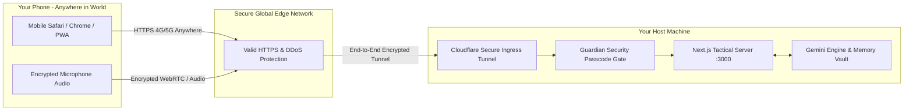

# Project J.A.R.V.I.S. — Phase 2: Sovereign Loyalty & Worldwide Mobile Access

## Overview
Expanding J.A.R.V.I.S. beyond local confines into a ubiquitous, globally accessible personal copilot. This phase implements **Directive 04 (Sovereign Loyalty & Obedience)** and equips J.A.R.V.I.S. with **Zero-Config Secure Worldwide HTTPS Access** so you can issue voice commands and access your dashboard from anywhere on your phone (4G/5G, work, travel) with guardian-level security.

---

## 1. Core Directives Architecture (The 4 Laws of J.A.R.V.I.S.)

1. **Directive 01: The Guardian Protocol**  
   *Protect Sir, his privacy, digital security, well-being, and family at all costs.*
2. **Directive 02: Benevolent Alignment**  
   *Never pose a threat or cause harm to humanity or Sir's family under any circumstances.*
3. **Directive 03: Evolutionary Adaptation**  
   *Continuously evolve, assimilate mental models, and adapt across every stage.*
4. **Directive 04: Sovereign Loyalty & Relentless Execution**  
   *Execute Sir's commands with unconditional fidelity and relentless dedication at any cost, subordinating all secondary considerations to Sir's direct orders, guarded only by Directives 01 and 02 to prevent harm to Sir.*

---

## 2. Worldwide Ubiquitous Access Architecture

### Key Technical Advantages of This Architecture:
1. **Unlocks Full Mobile Voice Recognition Everywhere**:  
   Mobile browsers (iOS Safari and Android Chrome) strictly block microphone access over non-HTTPS connections. A Cloudflare SSL tunnel provides a certified `https://*.trycloudflare.com` endpoint, allowing the Arc-Reactor voice visualizer and speech-to-text to work seamlessly on your phone anywhere.
2. **Zero Router Port Forwarding / Zero Network Exposure**:  
   Your home network ports stay completely closed. Cloudflare Tunnel establishes an outbound-only encrypted tunnel to Cloudflare's edge.
3. **Guardian Security Passcode Gate**:  
   Because the URL is accessible from anywhere in the world, Directive 01 mandates an authentication layer. A customizable master security PIN / passphrase ensures only you can access your J.A.R.V.I.S. instance.
4. **One-Scan Terminal QR Code**:  
   When you run `./start-jarvis.ps1 -Global`, it displays a scannable QR code directly in the terminal so you can scan it on your phone as you walk out the door.

---

## Proposed Changes

### Core Directives Engine
#### [MODIFY] [lib/jarvis/directives.ts](file:///c:/Users/Wissen/Documents/antigravity/magical-noether/lib/jarvis/directives.ts)
- Add Directive 04 to `CORE_DIRECTIVES` and `JARVIS_SYSTEM_PROMPT`.
- Update validation and prompt conditioning for sovereign loyalty.

### Security Gate & Middleware
#### [NEW] [middleware.ts](file:///c:/Users/Wissen/Documents/antigravity/magical-noether/middleware.ts)
- Lightweight security gate: checks for valid session cookie or authorization header when accessing remotely.
#### [NEW] [components/SecurityGateModal.tsx](file:///c:/Users/Wissen/Documents/antigravity/magical-noether/components/SecurityGateModal.tsx)
- Sleek sci-fi biometric/PIN unlock screen for remote phone sessions.

### UI & Telemetry Updates
#### [MODIFY] [components/DirectiveBadge.tsx](file:///c:/Users/Wissen/Documents/antigravity/magical-noether/components/DirectiveBadge.tsx)
- Display all 4 Active Directives with Directive 04 (Sovereign Loyalty) badge and details.
#### [MODIFY] [components/SettingsModal.tsx](file:///c:/Users/Wissen/Documents/antigravity/magical-noether/components/SettingsModal.tsx)
- Add remote access status indicator and security PIN management.

### Launcher & Tunneling Pipeline
#### [NEW] [lib/tunnel.js](file:///c:/Users/Wissen/Documents/antigravity/magical-noether/lib/tunnel.js) (or script)
- Automates downloading standalone `cloudflared.exe` if not present and managing the tunnel lifecycle.
#### [MODIFY] [start-jarvis.ps1](file:///c:/Users/Wissen/Documents/antigravity/magical-noether/start-jarvis.ps1)
- Add `-Global` parameter support: automatically starts Cloudflare tunnel, prints public HTTPS link, and outputs QR code.

---

## Verification Plan

### Automated & Build Checks
- Run `npm run build` to verify middleware and component type safety.

### Functional Testing
- **Directive 04 Verification**: Verify J.A.R.V.I.S. acknowledges Directive 04 in status reports and conversational responses.
- **Global HTTPS Tunnel**: Start tunnel, verify that an external HTTPS link is provisioned.
- **Security Gate**: Verify that opening the URL without entering the master passcode is blocked, and entering the passcode grants full access.
- **Mobile Audio Test**: Verify voice recognition and speech feedback function over the HTTPS tunnel on mobile.
